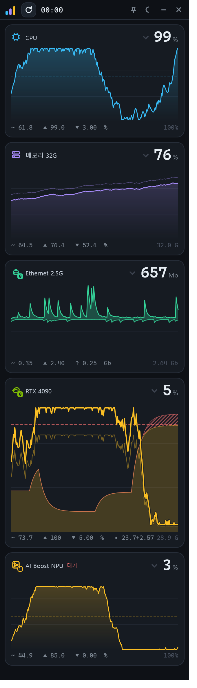

# ChronoLoad

GPU 중심의 실시간 시스템 모니터. 화면 구석에 세워 두고 **지금 무엇이 얼마나 쓰이고 있는지**를
한눈에 보기 위한 WPF 앱이며, 같은 정보를 **MCP**로 AI 에이전트에게도 제공한다.



## 무엇이 다른가

- **GPU가 주인공이다.** 어댑터마다 카드 하나. 사용률과 전용·공유 메모리를 한 차트에 겹쳐 그려서,
  VRAM이 넘쳐 시스템 메모리로 새는 순간을 바로 알아볼 수 있다.
- **다중 GPU와 NPU를 따로 센다.** RTX·Arc·AI Boost가 섞여 있어도 각각의 카드로 분리된다.
- **리셋 기준 통계.** 벤치마크를 시작하는 시점에 리셋하면 그 구간의 평균·최소·최대·p95를 누적한다.
- **시간 축이 하나다.** 모든 카드가 같은 시각 축을 쓰므로, 차트 위에 커서를 올리면
  "GPU가 멈춘 그 순간 디스크는 뭘 했나"를 한 번에 볼 수 있다.
- **감시 대상에 부담을 주지 않는다.** 샘플링 듀티 사이클 1% 미만이 설계 목표다. 데스크톱 0.97%,
  저전력 8코어 노트북은 순간 관측 1.47% · 4.3시간 적분 0.63%. 잠들어 있는 외장 GPU는 **깨우지 않는다**.

## 요구 사항

- Windows 10 1809 이상 (Windows 11 권장)
- .NET 10 런타임

GPU 온도·전력·클럭은 벤더 라이브러리가 있을 때만 나온다. 없으면 사용률과 메모리까지는 그대로 나온다.

| 벤더 | 경로 | 얻는 값 |
|---|---|---|
| NVIDIA | `nvml.dll` (드라이버에 포함) | 사용률 · 메모리 · 온도 · 전력 · 클럭 |
| Intel | `ControlLib.dll` (IGCL) | 온도 · 전력 · 클럭 |
| Intel | `ze_loader.dll` (Level Zero) | 클럭 — IGCL이 없을 때의 대체 경로 |
| AMD | — | **미지원.** 사용률·메모리는 PDH로 나온다 |
| 공통 | Windows PDH 카운터 | 사용률 · 전용/공유 메모리 |

## 빌드와 실행

```bash
git clone https://github.com/jinhwan-kim00/ChronoLoad.git
cd ChronoLoad
dotnet run --project src/ChronoLoad.App
```

게시본을 만들려면:

```bash
dotnet publish src/ChronoLoad.App -c Release -r win-x64
```

## 사용법

| 동작 | 방법 |
|---|---|
| 카드 접기 · 펴기 | 카드 헤더 클릭, 또는 `1`~`9` |
| 값 읽기 | 차트 위에 마우스를 올리면 그 시각의 값이 전 카드에 함께 표시된다 |
| 그 시점 고정 | 차트 클릭. 고정 상태에서 `←` `→`로 이동(`Shift`와 함께 10칸) |
| 고정 해제 | `Esc` |
| 시간 폭 | `Ctrl`+휠 — 30s · 60s · 3m · 10m · 15m. 표준(60s)이 아니면 제목 표시줄에 폭이 뜬다 |
| 표준 폭으로 복귀 | 차트 더블클릭 |
| 통계 리셋 | 제목 표시줄 왼쪽 버튼, 또는 `Ctrl+R` |
| 스냅샷 창 | ⟲ 옆 카메라 버튼 — 지금 버퍼를 떠내 고정한다. 여러 개 열어 비교할 수 있다 |
| 항상 위 | 핀 버튼 |
| 창 불투명도 | `Shift`+휠, 또는 설정에서 슬라이더 (25~100%) |
| 설정 | 슬라이더 버튼 — 불투명도 · 항상 위 · 테마 |
| 테마 | 달 버튼(라이트·다크), 설정에서는 시스템까지 셋 |
| 정보 · 버전 | 왼쪽 위 앱 마크 클릭 |

창 위치·크기, 항상 위, 불투명도, 테마, 카드별 접힘 상태는 **자동으로 저장**되어 다음 실행에 복원된다
(`%LOCALAPPDATA%\ChronoLoad\settings.json`). 장치는 인덱스가 아니라 키로 기억하므로,
장치가 하나 빠져도 나머지 설정이 밀리지 않는다.

공간이 모자라면 카드가 스스로 접힌다. 스크롤은 없다 — 세로로 긴 창에서 스크롤은
"한눈에 본다"는 목적과 충돌한다.

## MCP

앱이 실행 중일 때 **로컬 MCP 서버**가 함께 뜬다. 에이전트가 시스템 상태를 직접 조회할 수 있다.

### 연결

배포 패키지를 쓴다면 압축을 푼 폴더의 `chronoload-mcp.exe` 를 가리키면 된다.

```bash
claude mcp add chronoload -- <압축을 푼 경로>\chronoload-mcp.exe
```

소스에서 빌드했다면:

```bash
claude mcp add chronoload -- <저장소>\tools\ChronoLoad.McpBridge\bin\Debug\net10.0-windows\chronoload-mcp.exe
```

브리지는 stdio ↔ HTTP 프록시다. HTTP 전송을 직접 지원하는 클라이언트라면
`http://127.0.0.1:7667/mcp`에 붙어도 된다(토큰 필요, 아래 참조).

### 툴

| 툴 | 쓰임 |
|---|---|
| `get_system_snapshot` | CPU·메모리 + GPU·디스크·네트워크 배열. 첫 조회용 |
| `get_gpu_status` | 어댑터별 사용률·메모리·온도·전력·클럭, VRAM 초과 여부, 센서 계층 |
| `get_disk_status` | 디스크별 읽기·쓰기·활성 비율, 매체(SSD/HDD) |
| `get_network_interfaces` | 인터페이스별 수신·송신. 터널은 기본 제외 |
| `get_metric_history` | 최근 시계열. min-max 데시메이션이라 스파이크가 사라지지 않는다 |
| `get_stats_since_reset` | 리셋 이후 평균·최소·최대·p95·표준편차 |
| `reset_stats` | MCP 쪽 기준점만 옮긴다. 직전 구간을 반환한다 |
| `list_processes` | CPU·메모리·GPU·GPU 메모리·디스크 I/O로 정렬 |
| `get_process_detail` | 프로세스 하나의 어댑터별·엔진별 GPU 사용률 |
| `describe_capabilities` | 무엇을 관측할 수 있는지, 지금 샘플 주기는 어떤지 |

리소스 `chronoload://snapshot` · `chronoload://stats`와
프롬프트 `analyze_gpu_workload`(병목 진단 템플릿)도 함께 제공한다.

### 응답을 읽을 때

- 모든 응답에 `sampledAt` · `stale` · `devicesRevision`이 붙는다.
  `devicesRevision`만 비교하면 "내가 알던 장치 구성이 그대로인가"를 알 수 있다.
- 장치 배열의 원소는 `index`와 `key`를 모두 갖는다. **재조회에는 `key`를 쓴다** —
  인덱스는 장치가 빠지면 밀린다.
- **값이 없으면 `null`이다. 0이 아니다.** 계층이 `PDH`인 어댑터는 온도·전력·클럭이 없고,
  `availability`가 `standby`면 저전력 대기라 일부러 읽지 않은 것이다.
- `sampling.pace`가 `full`이 아니면 창이 최소화됐거나 기기가 버거워 주기가 느려진 상태다.

### 앱이 꺼져 있으면

`initialize`와 목록 조회는 성공하고, 실제 툴 호출만
`{"error":"app_not_running"}`을 돌려준다. 앱을 켜면 클라이언트를 다시 시작하지 않아도 바로 붙는다.

헤드리스 모드는 제공하지 않는다. 앱 없이 수집하면 "리셋 기준 통계"도 "히스토리"도 가질 수 없어
이 MCP의 가치 대부분이 사라진다. 반쪽짜리 응답보다 명확한 실패가 낫다.

### 보안

- `127.0.0.1` 고정. 외부 바인딩 옵션은 없다
- 기동 시 임의 토큰을 `%LOCALAPPDATA%\ChronoLoad\mcp.token`에 쓰고 종료 시 지운다
- `Origin` 헤더 검증(DNS 리바인딩 방어), 토큰 비교는 상수 시간
- **읽기 전용이 원칙.** 상태를 바꾸는 툴은 `reset_stats` 하나뿐이고,
  프로세스 종료·우선순위 변경 같은 것은 제공하지 않는다

## 배포 패키지 만들기

```cmd
build-release              :: 자체 포함 — 받는 사람이 .NET 을 설치하지 않아도 된다
build-release framework    :: 런타임 의존 — 작지만 .NET 10 데스크톱 런타임이 필요하다
```

두 가지가 `dist\` 에 나온다.

| | 쓰임 |
|---|---|
| `ChronoLoad-<버전>-<종류>\` | **푼 그대로.** 이 PC 에서 그냥 쓸 때는 안의 `ChronoLoad.exe` 에 바로가기를 만든다 |
| `ChronoLoad-<버전>-<종류>.zip` | 남에게 줄 때 |

둘 다 실행 파일, MCP 브리지, 이 README 를 담는다.

| 종류 | 크기 | 받는 사람에게 필요한 것 |
|---|---:|---|
| 자체 포함 | 약 122 MB | 없음 |
| 런타임 의존 | 약 1.8 MB | [.NET 10 데스크톱 런타임](https://dotnet.microsoft.com/download/dotnet/10.0) |

> 다시 빌드하면 그 폴더를 지웠다 새로 만든다. **바로가기로 띄워 둔 앱은 먼저 닫는다** —
> 열려 있으면 폴더를 지우지 못하고, 스크립트가 그 이유를 알려주며 멈춘다.

## 문서

- [PROJECT.md](PROJECT.md) — 설계서. 요구사항부터 구현에서 막혔던 지점까지
- [CHANGE_LOG.md](CHANGE_LOG.md) — 개정 이력
- [docs/ux-design.html](docs/ux-design.html) — UX 설계서(브라우저로 열면 동작하는 목업)

## 현재 상태

0.9.0. 화면·수집·MCP는 동작한다. 데스크톱(외장 GPU 2장)과 노트북(Lunar Lake 내장 GPU + NPU,
서로 다른 배율의 모니터 2대) 두 기기에서 확인했다. 남은 것:

- AMD ADLX 경로 — 검증할 하드웨어가 없어 보류
- 배터리 절전 경로 — 코드는 있으나 아직 한 번도 실행된 적이 없다.
  Windows 11의 "항상 절전 모드 사용"은 효과(화면 밝기 감소)가 실제로 적용되는데도
  Win32·WinRT 상태 API가 둘 다 꺼짐으로 답한다. 감지할 방법을 다시 찾아야 한다
- 24시간 누수 테스트 — 4시간 19분까지 늘렸다. **GDI 객체는 누수 없음으로 판정**했고 핸들·스레드도
  추세가 없다. 다만 커밋 메모리는 잡음이 커(σ 5.4MB) 이 길이로는 10MB/24h 목표를 **판정할 수 없다** —
  약 26시간이 필요하다
- 저전력 8코어 노트북의 샘플링 듀티 사이클 — 짧은 순간 관측 1.47%, 4.3시간 적분 0.63%.
  어느 쪽을 목표와 견줄 대표값으로 삼을지 아직 정하지 않았다
- 배포본(단일 파일 + 압축)이 일반 빌드보다 커밋 메모리를 104MB 더 쓴다 — 압축 해제본이
  파일 매핑이 아니라 프라이빗 커밋에 올라가기 때문으로 보인다 (확인 중)
- 내장 GPU의 클럭 값이 현재값이 아니라 최대값으로 보인다 (확인 중)
